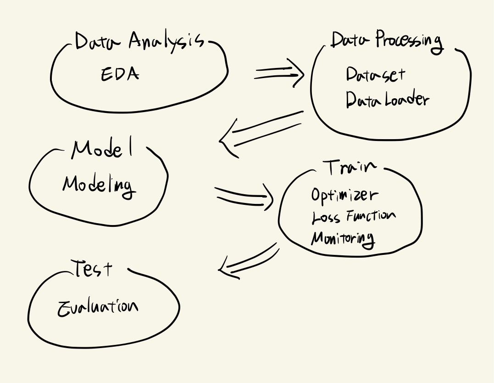
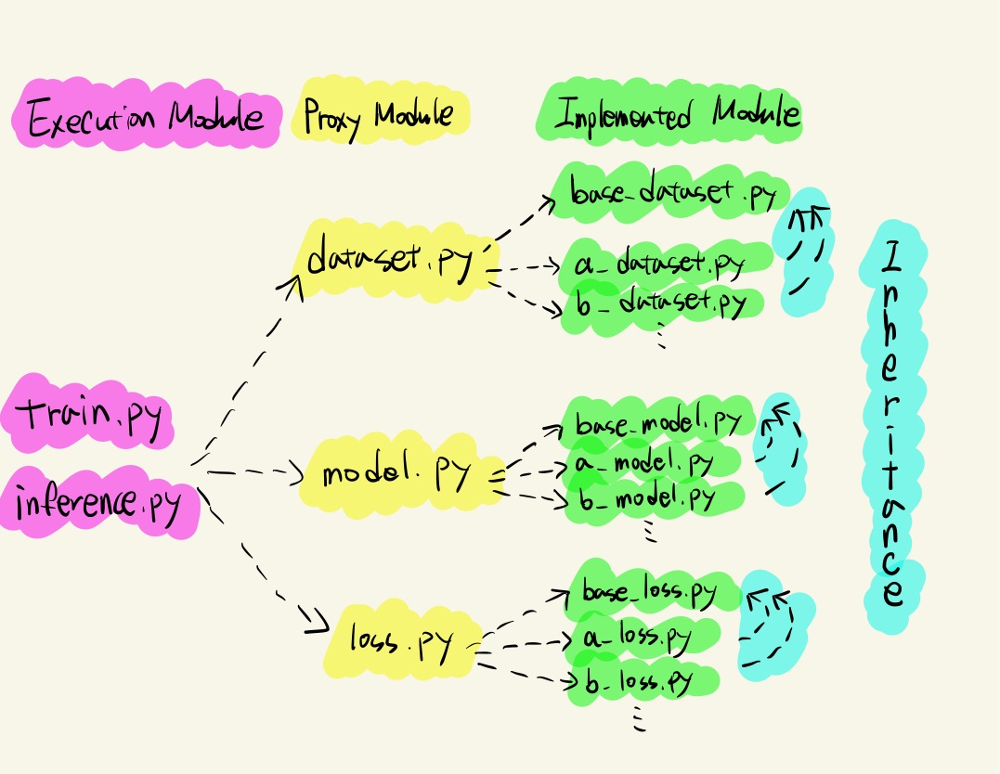
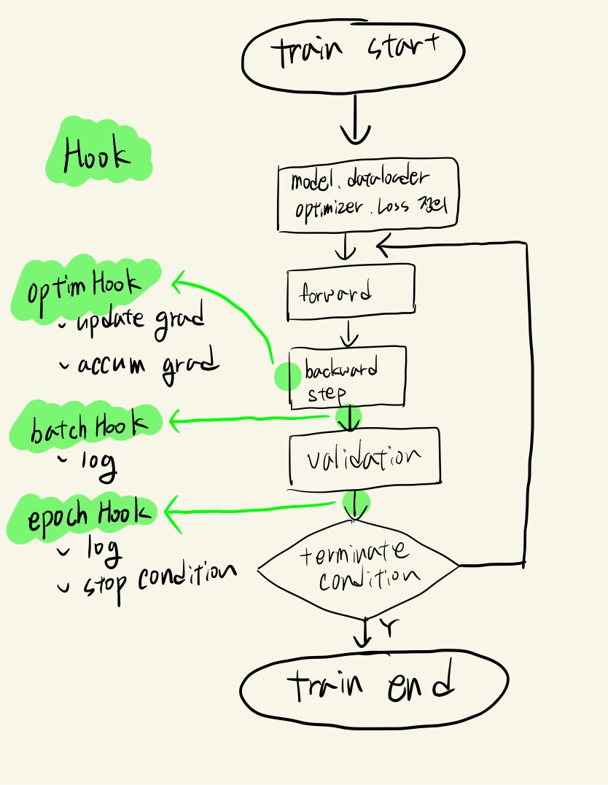

## Summary 🤙

      

* 기간 : 21.8.23 ~ 21.9.2 (2주)    
* Task : 사람 얼굴 이미지의 마스크 착용 여부, 성별, 나이 분류
* 팀 구성 : 유관식, 김종현, 김준섭, 이윤영, 조성욱, 한태호 

 

## Index 👀     

      

  * [목표](#목표)
  * [프로세스](#프로세스)
  * [파이프라인](#파이프라인)
  * [마치며](#마치며)
  
 

  
## 목표

이번 프로젝트는 나의 첫번째 ML 프로젝트이기 때문에 전체적인 프로세스를 이해하는 것에 중점을 두어 다음과 같이 목표를 설정했다.     

* __"현업이라면?"__ 이라는 고민을 지속적으로 가져가기 (대회를 위한, 또는 학습만을 위한 프로젝트가 되지 않도록)
* 데이터부터 프로덕트 서빙 직전까지의 프로세스 이해
* 공동작업을 위해 코드 레벨에서의 중앙 파이프라인 구성 및 모듈화 
* pytorch, python에 대한 이해
* 다음 프로젝트에 성능 향상에 집중할 수 있도록 나만의 파이프라인 패턴 구성

__요약하면, 모델 성능을 끌어올리기 위한 노력보다는 여러 사람이 다양한 실험을 해볼 수 있는 좋은 실험실을 구성하는 것을 목표로 잡았다.__      

이러한 목표를 기반으로 이번 프로젝트를 통해 내가 얻은 성과는 아래와 같다.         

 

## 프로세스

이 프로젝트는 주어진 대회용 데이터를 기반으로 프로덕트 서빙 전까지의 과정만 진행했다.      

     

1. Data Analysis, EDA(Exploratory Data Analysis)
   1. 훈련에 사용할 데이터를 다양한 각도로 살펴보는 과정이다.  
   2. input으로 주어지는 데이터의 feature간 분포, 관계를 파악한다.
   3. label의 분포를 확인하면서 데이터의 불균형 문제는 없는지, 누락되거나 잘못된 labeling은 없는지 확인한다.
   4. input과 label의 관계를 파악한다.
   5. 정해진 형식은 없으나, 협업을 위해서는 한눈에 들어올 수 있는 그래프, 차트 형태로 가시화하는 것이 좋다.
2. Data Processing
   1. Dataset
      1. raw data(이미지)를 모델에 feeding하기 위한 모듈이다. 
      2. 훈련을 위한 dataset은 input과 label을 반환해줄 수 있도록 구현한다.
      3. Data Augmentation, label handling 등의 과정이 포함된다.
      4. 이미지 데이터는 용량이 크기 때문에 학습하는 환경을 고려하여 데이터를 어느시점에 메모리에 올릴 것인지 선택한다. (init || getitem)
   2. DataLoader
      1. Dataset을 학습 간 환경에 맞추어 효율적으로 feeding 하기 위한 모듈이다.
      2. batch size나 multiprocessing 과 같은 요소들이 중요하다. 
      3. Dataloader는 cpu를 사용하기 때문에, 실제 학습이 수행되는 gpu가 최대로 활용될 수 있도록 위에 언급한 요소들을 적절히 잘 조절해야한다.
3. Model
   1. 학습을 수행할 모델을 정의한다.
   2. 대부분의 경우 완전히 처음부터 모델을 설계하기보다는 이미 검증된 모델을 가져와 fine-tuning하는 방식으로 모델을 정의하게 된다.
4. Train
   1. Optimizer
      1. 모델의 파라미터를 업데이트 하기위한 모듈이다.
      2. Adam을 주로 사용했고, Learning Rate 값도 Optimizer를 통해 관리한다.
   2. Loss Function
      1. label과 prediction의 차이를 나타내는 함수이다.
      2. CrossEntropy, FocalLoss, F1Loss 등 다양한 함수를 활용했다.
   3. Monitoring
      1. 머신러닝 프로젝트의 특징이 가장 잘 나타내주는 모듈이다. 일반 애플리케이션은 컴파일 단계에서 대부분 오류가 발생하지만, 머신러닝 프로젝트는 돌아가는 코드라도, 성능이 적절하지 않다면 그것이 곳 오류이기 때문에 모니터링이 생각보다 많이 중요했다.
      2. Tensorboard를 통해 loss, accuracy, f1score 등을 확인했다.
      3. 텍스트 파일 형태의 로그를 통해 ssh을 백그라운드로 실행시키더라도 이후에 로그를 확인할 수 있도록 했다.
      4. wandb를 통해 tensorboard와 비슷한 차트를 구성했다.
      5. 어떤 시점에 어떤 조건으로 모델을 저장할 지 판단하는 기준이 된다.
5. Test
   1. Testset 데이터에 대한 inference를 수행한다.
   2. Trainset 데이터에서 취해주었던 전처리를 동일하게 취해주어야 학습된 모델의 정확한 inference가 가능했다.

 

## 파이프라인 

팀원들과 협업을 하기위해 아래와 같은 목표를 가지로 파이프라인을 구조화했다.       
1. 중앙 파이프라인 코드는 추상화된 모듈, 또는 실행 시점의 argument를 기반으로 작성하여 실험의 다양성에 적응할 수 있는 재사용 코드여야한다.
2. 머신러닝 프로세스에 기반하여 프로세스의 각 노드 별 역할과 책임이 패키지로 명확히 분리되어야 한다.
3. 각 노드별 공통으로 사용되는 모듈은 추상화 되어야하고, 이를 상속하여 구현함으로써 코드 재사용성을 높인다.
4. 각 훈련에 대한 정보는 분석에 용이한 로그로 남아야 한다.

위와 같은 목표로 다음과 같이 구조화 하였다.        

 

## Hook을 통한 코드 재사용 

Train이 이루어지는 과정은 위의 순서도와 같이 반복되며, 커스터마이징 되어야하는 부분을 3가지로 분류하여 hook을 통해 처리하면서 Train에 대한 코드는 계속 재사용 되도록 하였다.         
       

1. OptimHook
   1. Loss function의 인자 값이 추가로 요구되는 경우
   2. Gradient를 update하거나, Accumulate하는 처리 
2. BatchHook
   1. batch마다 호출되는 hook
   2. log 관련 코드 작성 (tesorboard, wandb, textlog ...)
3. EpochHook
   1. epoch마다 호출되는 hook
   2. log 관련 코드 작성 (tesorboard, wandb, textlog ...)
   3. early stopping 등 훈련 종료 조건 코드 작성

 

## 마치며

      
이번 프로젝트를 통해 머신러닝 프로세스가 어떻게 진행되고 코드로 어떻게 구조화할 수 있는지에 대한 이해가 높아졌다.       
다양한 모델, 데이터 전처리 등과 같이 모델의 성능을 올리는 노력은 많이 못했지만, 적어도 앞으로 남은 프로젝트들에서 다양한 실험을 해볼수 있는 나만의 환경을 구축한데 의미가 있다.      
이는 훈련을 위한 개발 작업에서 오버헤드를 상당히 줄여줄 수 있을 것으로 기대한다.       
나만의 템플릿을 지속적으로 유지하면서 협업에도 용이한 코드로 지속 발전해나갈 예정이다.           

   

