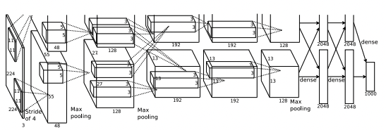

## Summary 🤙

ILSVRC(ImageNet Large Scale Visual Recognition Challeng)는 이미지 인식을 주제로한 대회이다.      
CNN 기본 개념을 바탕으로 최근 대회에서 우수한 성적을 거뒀거나, 많이 사용되는 모델이 대해 알아보자.

  

## Index 👀       
  * [AlexNet](#alexnet)
  * [VGGNet](#vggnet)
  * [GoogleNet](#googlenet)
  * [ResNet](#resnet)
  * [DenseNet](#densenet)
  
  

## AlexNet  

[Paper 📃](https://paperswithcode.com/method/alexnet)

* ReLU activation function
* 2 GPUs
* Data argumentation
* Dropout
* LRN(Local Response Normalization)
* 11x11 kernel
* 5 convolution layers - 3 dense layers

  

## VGGNet  

  

## GoogleNet  

  

## ResNet  

  

## DenseNet  

  

